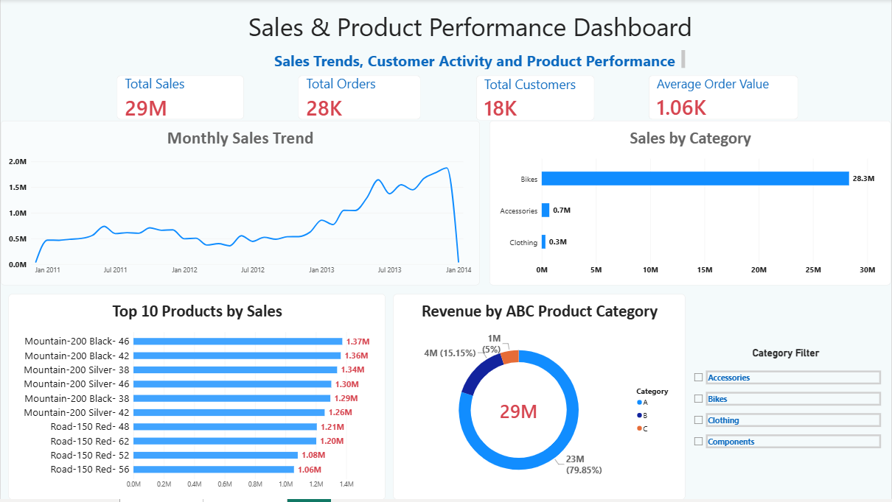
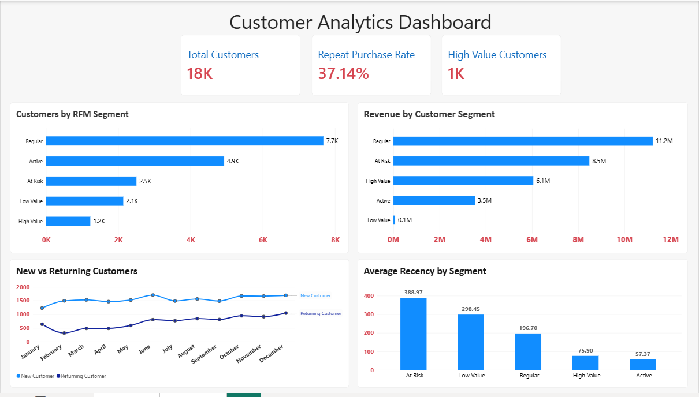

# Sales & Customer Analytics

End-to-end sales and customer analytics project using **Microsoft SQL Server** and **Power BI**.

## Overview

Analyzed transactional sales data to identify trends in revenue, customer behavior, product performance, and repeat purchasing patterns.

The project includes SQL-based analysis, customer/product segmentation, RFM analysis, ABC product analysis, and interactive Power BI dashboards.

## Tools

- Microsoft SQL Server
- Power BI
- SQL
- DAX
- Power Query

## Key Metrics

- Total Sales: **~29M**
- Total Orders: **~28K**
- Total Customers: **~18K**
- Average Order Value: **~1.06K**
- Repeat Purchase Rate: **37.14%**

## Dashboard

### Sales & Product Performance



Includes:
- Monthly Sales Trend
- Sales by Category
- Top 10 Products
- ABC Product Segmentation
- KPI tracking

### Customer Analytics



Includes:
- RFM Customer Segmentation
- Revenue by Customer Segment
- New vs Returning Customers
- Repeat Purchase Rate
- Customer Recency Analysis

## SQL Analysis

The SQL analysis includes:

- CTEs and Window Functions
- Running Totals
- `LAG()` for YoY analysis
- Customer Segmentation
- Product Segmentation
- RFM Analysis using `NTILE()`
- New vs Returning Customer Analysis
- Repeat Purchase Analysis
- ABC / Pareto Product Analysis

## Project Structure

```text
Datasets/
PowerBI/
SQL/
Screenshots/
README.md
```

## Key Insights

- Bikes contribute the majority of overall sales.
- A relatively small group of products generates most of the revenue.
- RFM analysis identifies high-value, active, regular, and at-risk customer groups.
- Repeat purchase rate is approximately **37%**.
- Customer recency helps identify segments requiring re-engagement.

## Files

- `SQL/sales_customer_analysis.sql` – Complete SQL analysis
- `PowerBI/Sales_Customer_Analytics_Dashboard.pbix` – Power BI dashboard
- `Screenshots/` – Dashboard previews

## Author

**Avni Katarey**
